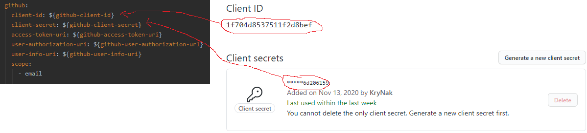

# Bill Manager

Simple bill management application created with Spring Framework.

## Table of contents
* [General info](#general-info)
* [Technologies](#technologies)
* [Setup](#setup)

## General info

It is a simple database application that allows you to add and track expenses on a given day. Additionally, the application provides a login (supports social login) and registration system (along with email confirmation). This is my first such large application using Spring framework. The purpose of this project is to learn the Spring framework.

## Technologies
* Java 11
* Spring (Oauth2, Security, JPA, Web, Lombok, Mail)
* HTML / Thymeleaf
* CSS (Materializecss, Bootstrap)
* Javascript (jQery)

## Setup

For the project to work properly you need to install maildev tool which allows you to keep track of the emails you send. The first command is responsible for downloading and installing maildev (you must have npm package manager installed) and the second is responsible for running it.

```
$ npm install -g maildev
$ maildev
```

Additionally you have to register your application on services like facebook, google, github to make social login work properly. 

### Github
Here is a link to a github doc that takes a closer look at application registration.  
https://docs.github.com/en/developers/apps/creating-an-oauth-app

Then, after following the steps in the link, copy the selected values to application.yml  

